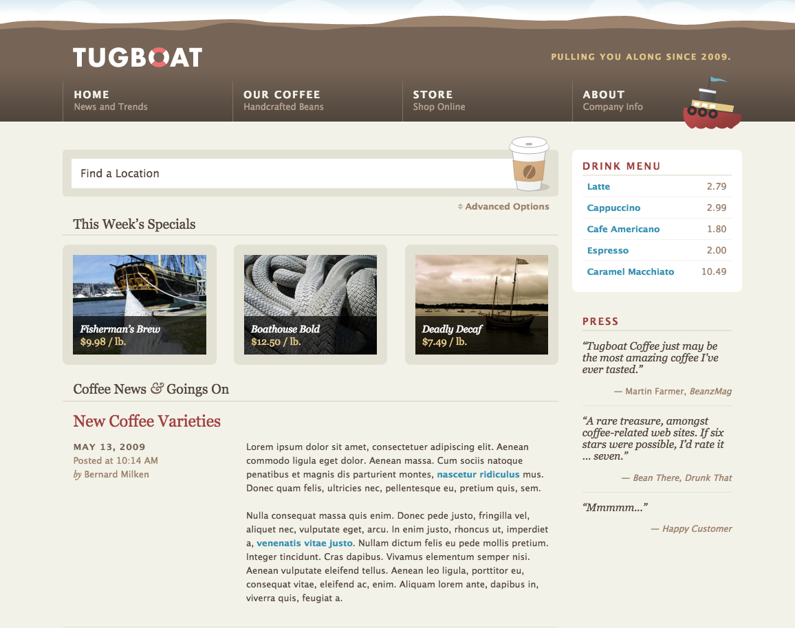

# Week 1

### [Class 1 (w1d1): Getting Started & Introduction to HTML](./w1d1)

#### Lecture
* Course Overview ([slides](./w1d1/slides/w1d1_overview.pdf))
* Introduction to HTML ([slides](./w1d1/slides/w1d1_html.pdf))

#### Exercises
* HTML Table Exercise: Country Data
* HTML Form Exercise: E-Commerce Checkout

##### Homework

* Watch: Command line tutorial - [Linux/Mac Users](https://www.youtube.com/watch?v=AfM11G2NYxg) or [Windows Users](https://www.youtube.com/watch?v=zBXe-IaNJps)
* Read: [Teach Yourself Programming in 10 Years](http://norvig.com/21-days.html) by Peter Norvig
* Watch: [Programmers are herd animals](https://www.youtube.com/watch?v=lrf6xuFq1Ms) by FunFunFunction (mpj)

##### Additional Resources
* [HTML Dog HTML Reference](http://htmldog.com/references/html/tags/)

---

### [Class 2 (w1d2): Intermediate HTML and Intro to CSS](./w1d2)

#### Lecture
* Intermediate HTML ([slides](./w1d2/slides/w1d2_html_css.pdf))
* Introduction to CSS
* Using [CodePen](http://codepen.io/)

#### In-Class Exercises
* CSS Exercises

#### Resources
* [CSS Tricks](https://css-tricks.com/) - Great blog full of CSS tips & tricks
* [CodePen](http://codepen.io/) - Playground for the front end web
* [HTML Dog CSS Reference](http://htmldog.com/references/css/properties/)

---

### [Class 3 (w1d3): HTML & CSS: Putting it all together](./w1d3)

#### Lecture
* **HTML & CSS Tips & Tricks** ([slides](./w1d3/slides/w1d3_html_css.pdf))
  * [CSS Psuedo-classes](https://developer.mozilla.org/en-US/docs/Web/CSS/Pseudo-classes)
  * [CSS Psuedo-elements](https://developer.mozilla.org/en-US/docs/Web/CSS/Pseudo-elements)
  * Floats & Clearing Floats
  * Using Chrome Developer Tools
  * [Using a list to display a navigation menu](codepen.io/rcacademy/pen/GZyMBJ)
  * CSS Resets & using more than one stylesheet

#### In-Class Exercises
1. Review code for a [CSS Button](http://codepen.io/rcacademy/pen/JXMPRa)
2. [Layout Walkthrough](./w1d3)
3. Floats & Clearning [Code Walkthrough](http://codepen.io/rcacademy/pen/MyrEWJ)
4. Review code for [User Badges](http://codepen.io/rcacademy/pen/yOpLWd)
5. Build your own [HTML/CSS Profile Page](./w1d3#html--css-project)

#### Homework
* Work on your Profile Page to demo in class on 4/11
* _Optional: Front End Bonus Project (details below)_

#### Additional Resources
* [Handcrafted CSS](../resources/handcrafted_css.pdf) - This book covers a lot of common gotchas in HTML & CSS - full PDF available at this link. Not required reading but a great thing to read through as you learn HTML/CSS.

----

#### Front End Bonus Project
We will not be covering all of this in the course but if you want to get really good at frontend HTML/CSS, take a crack at building the Tugboat Coffee website (or at least looking through the code that makes it work with Chrome Developer Tools). You can find the tugboat code in the `resources` folder. This is a very involved website that makes use of a lot of CSS tricks to illustrate how they can be used.

