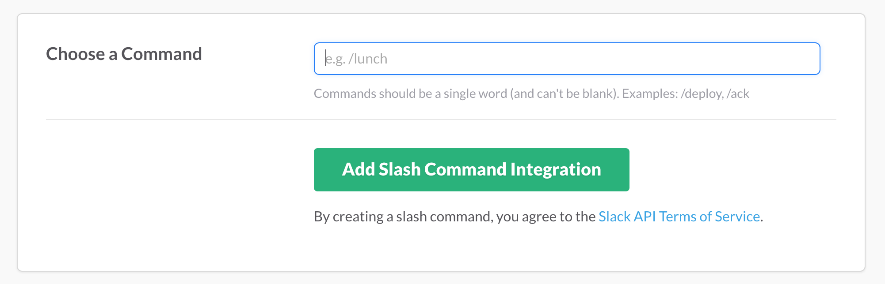

# Building a Slack Bot with Slash Commands

## Various Slack Bots
There are a few different ways to interact with Slack and the Slack API.

1. Slack Slash Command Bots
2. Slack Integrations
3. Real Time Messaging (RTM) Bots

### Slack Slash Command Bots
To get started, these are the bots we are going to focus on. Slash commands allow us to create a small web server and call a method on our server from predefined commands in slack. We could build a pizza delivery bot that allowed you to order a pizza by entering `/order pizza`. In this case, the order command would send a message to our server with the other data we supplied so that an order could be placed.

### Slack Integrations
These webhook integrations allow other services to send updates and data to Slack but you as a user can't interact with them. Example might include a slack message showing up every time you pushed a git commit to Github or purchased something using Paypal.

### Real Time Messaging (RTM) Bots
Finally, we can also build RTM bots that sit inside of slack and look just like a user. They have the ability to come online, go to "away" mode or go offline and you can chat with them as you might with another human user by using their `@` name. In our pizza delivery example, we might have a bot user called **pizzadelivery** so we could chat with the user to order a pizza. `@pizzadelivery order a large pizza` and it can have a conversation with you to ask more questions. In this example, we might ask what toppings they want and where to deliver and charge the pizza to.


# Your Mission
Your mission, should you choose to accept it, is to build a slash command bot similar to the one outlined below.

- [ ] Think about what kind of bot you would use day to day in Slack
- [ ] Find an API that would allow you get data from the outside world (weather, bitcoin, github, etc)
- [ ] Allow a user to enter a slash command with one or more parameters
- [ ] You don't have to use an API if you have another novel idea for a bot but it is highly encouraged. A tip calculator would be pretty cool though.

Weather examples: `/weather 89509` or `/weather today 89509`

As always, should you or any of your I.M. Force be caught or killed, the Secretary will disavow any knowledge of your actions. This disc will self-destruct in five seconds. Good luck.

## Getting started
We are going to build a simple slash command bot using Ruby and the Sinatra framework.

**Create a project with the following files:**
  * **app.rb** - where your app logic will live
  * **Gemfile** - your app dependencies
  * **config.ru** - server configurations
  * **README.md** - your README documentation


**Gemfile**
```ruby
source 'https://rubygems.org'

gem 'sinatra'
gem 'httparty'
```

Save the Gemfile and run:

```bash
bundle install
```

Now that we have added our dependencies, we can write our main app. We're going to cover this example in person during the lecture but it is a simple slash command bot that accepts a single command. It can easily be extended to more than one command or to allow a user to pass in more than one piece of information at once.

The following code will allow you to run `/bitcoin price`. The "price" text will be sent over in `params[:text]`. We then use a [case statement](http://www.skorks.com/2009/08/how-a-ruby-case-statement-works-and-what-you-can-do-with-it/) to control what happens for each command. Again, this bot only supports "price" but it could we could add other commands by adding more `when` statements to the `case` block.

Running `/bitcoin price` returns the following to our user. This response is only visible to the person requesting the information. You can explore the [Slack slash command documentation](https://api.slack.com/slash-commands) for more options that we can pass in.


**app.rb**
```ruby
# My Bitcoin Slack Bot

require 'sinatra'
require 'httparty'
require 'json'

post '/process_command' do
  return if params[:token] != ENV['SLACK_TOKEN']

  text = params[:text]
  spot_price_url = 'https://api.coinbase.com/v2/prices/spot'

  case text
    when 'price'
      resp = HTTParty.get(spot_price_url)
      resp = JSON.parse resp.body
      respond_message "The current Bitcoin spot price is $#{resp['data']['amount']} #{resp['data']['currency']}."
  end
end

def respond_message message
  content_type :json
  {:text => message}.to_json
end
```

**config.ru**
```ruby
require './app'
run Sinatra::Application
```

### Deploying to Heroku
Once you've put together this example app, you will want to turn on version control with git for this project.

```bash
git init
git add .
git commit -am "added initial bot files"
```

Then you can create an app in Heroku and deploy it by pushing to your `heroku` git remote.

```bash
heroku create <your_app_name>
git push heroku master
```

```bash
remote: -----> Compressing...
remote:        Done: 17.6M
remote: -----> Launching...
remote:        Released v12
remote:        https://btcspotbot.herokuapp.com/ deployed to Heroku
remote:
remote: Verifying deploy... done.
To https://git.heroku.com/btcspotbot.git
   883ee7a..e5b9ad5  master -> master
```

#### Register our slash command bot with Slack

Go to the [Apps & Integrations](https://rcacademy.slack.com/apps) setting menu in Slack. Click on **Build** in the top left navigation and select **"Something just for my team"** and click on "Make a Custom Integration".

For this bot, we are selecting **Slash Commands**.

Select the name of your slash command. This has to be unique to our Slack organization so two people can't do `/weather` so be creative! Click **Add Slash Command Integration**.



Now we are going to see an example of Outgoing Data. This is an example of the data that Slack will be sending to us when someone types in our slash command.

Below that you can read more about how to respond to those commands.

Continue further to **Integration Settings**.

Here we will setup our bot and get our Slack API token for this slash command.

Take the URL of your Heroku app (https://btcspotbot.herokuapp.com/) and add the name of the path in our app (/process_command) to give us a full url of `https://btcspotbot.herokuapp.com/process_command` and enter it in the URL setting.

Keep the **method** set as `POST`.

Take note of the **token** that Slack is providing to us. We can copy and paste it from here or regenerate a new one.

Give your slash command a name. This will be the name of the bot user that responds with your bot's message.

Give your bot some character by uploading a photo or selecting an emoji :robot_face:.

Now we can give your awesome slash command some preview text. This text exists to tell your users what they can do with your slash command.

Finally, click **Save Integration**.

:warning: Your bot won't work yet! We need to set your Slack Token in the Heroku environment variables.

#### Adding your Slack token

In our example app above, we have a check on the first line of our `/process_comamnd` method that checks to see if the token that Slack sends us matches the token that we are using for our app. This token is given to us by Slack when we created our slash command integration. We `return` immediately if the tokens do not match (or if the `SLACK_TOKEN` environment variable is empty).

```ruby
return if params[:token] != ENV['SLACK_TOKEN']
```

You will want to grab your slack token from the Slack integration dashboard and set it in your Heroku app.

```bash
heroku config:set SLACK_TOKEN=XXXXXXYYYYYYZZZZZZ
```

You should now be able to try out your slash command in Slack!

#### Debugging your Slack Bot

You can view the logs of your bot from your terminal with:

```bash
heroku logs -t
```

Try sending it different commands to test if it is responding correctly.
