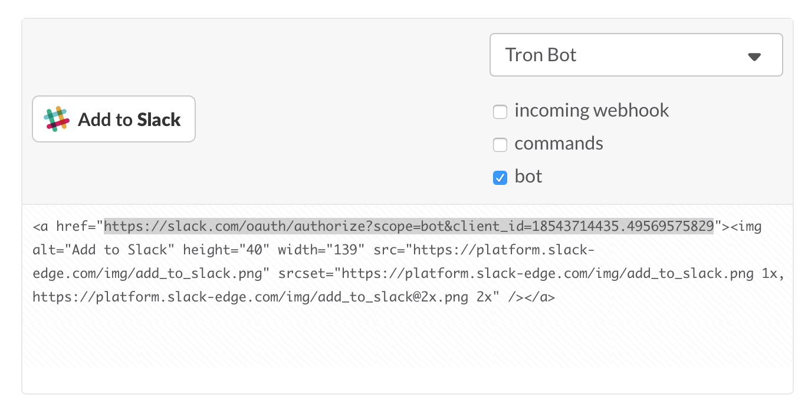

# Building Intelligent Bots and working with 3rd Party Services

## Using an Intelligence as a Service API

We will be using the [api.ai](http://api.ai) service to add a sense of artifical intelligence to our slack bots.

This is going to be an oversimplification of what is required to build a bot with this level of sophistication but fortunately we live in a time where these complex services are available to us via Web APIs.


### Getting Started

Create an account at [http://api.ai](http://api.ai).

**VIDEO** [Getting Started with api.ai](https://www.youtube.com/watch?v=Om7tyGGemXI)

**VIDEO** [Building a Slack bot with api.ai](https://www.youtube.com/watch?v=cCCKOLFEXBU)


### Setting up your AI Agent

We will discuss how to setup the AI Agent in lecture or you can watch this video as it is fairly involved: [Getting Started with api.ai](https://www.youtube.com/watch?v=Om7tyGGemXI)

* Create an AI Agent in api.ai
* Go to your agent's settings and turn on "Slack" under the Integrations tab.
* [Create a Slack App](https://api.slack.com/slack-apps) in Slack
* Take the URL that api.ai gives us and use it as a redirect url in our Slack app.
* Copy and paste the Client ID and Client Secret from your Slack app and paste them into api.ai's Slack integration settings.


### Adding your own app & bot to our Slack

Under your [Slack app]((https://api.slack.com/slack-apps), click on **Bot Users** and add a Bot User to your Slack app.

Now we want to link this Bot user to our account instead of the apiai_bot.

Go to the [Slack Button settings page](https://api.slack.com/docs/slack-button) and scroll down until you see an interactive area to setup an "Add to Slack" button.

Uncheck all the boxes and check **bot**.



The generated code will have a link and an image in it. You can put this link on your website to allow others to use your slack bot or you can grab the URL out of the `<a href ="SOME URL">` tag and just go to that url to add your bot to our slack.


### Creating a Sinatra app to respond to your Agent

Now that we are using **api.ai** to manage our conversations we still need a way to get custom information for our bot. For example, if you are making a bot that tells you about the weather, we would need to call out to a weather API.

Right now your bot responds with more questions and answers but it doens't do anything.

We can have these commands sent to us from api.ai to a Sinatra app running on Heroku.

This will work a lot like our slash command bots that we built earlier this week.

1. The user will say something.
2. api.ai will process it
3. If it is a match and it needs more information, it will ask for more information
4. If it is a match and it has all the information it needs, it will send the data to our Sinatra app on Heroku
5. Our Sinatra app will call out to the weather API and get a response
6. Our Sinatra app responds back to api.ai and that response is then replied in Slack.

### Example Sinatra app to handle the webhook
```ruby
require 'sinatra'
require 'httparty'
require 'json'

post '/webhook' do
  @params = params
  p @params
  # get the weather here
  respond_message 
end

def respond_message message
  content_type :json
  {:text => message}.to_json
end

```

##### Resources
* [api.ai Webhook Docs](https://docs.api.ai/docs/webhook)
* [api.ai Slack Webhook Guideline](https://docs.api.ai/docs/slack-webhook-integration-guideline)
* **VIDEO**: [Using api.ai Webhooks](https://www.youtube.com/watch?v=FrxdKXuHox0)


### Debugging your Webhook App

Add `$stdout.sync = true` to your _config.ru_ file before you call `run Sinatra::Application` in order to surface your app's output to the debug log.

**config.ru**
```ruby
require './app'
$stdout.sync = true
run Sinatra::Application
```

Once you've done that and pushed it to Heroku, you can view the output by tailing the Heroku log files.

```bash
$ heroku logs -t
```
