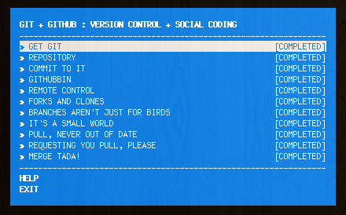

# Git-It Workshop

This workshop was created by [@jlord](http://github.com/jlord) on Github to help teach some of the mechanics of git and Github.

### Installing Git-It

Start off by installing the workshopper by running `npm install git-it` in your terminal.

### Working through the exercises
To pull up the exerices, type in `git-it`. Hit enter on the first one and work through each of them.

The instructions for each step can be found locally at the url defined in the instructions.

When you think you've completed an exercise, verify it by entering `git-it verify` and it will provide you with some feedback.

Read through all the instructions carefully!

### Troubleshooting
There are a couple known issues with the workshop and we are working with the creator to fix them. They will not happen to everyone but if you run into an issue, let us know!

They are most likely to happen with the `remote control` and `forks and clones` exercises.
