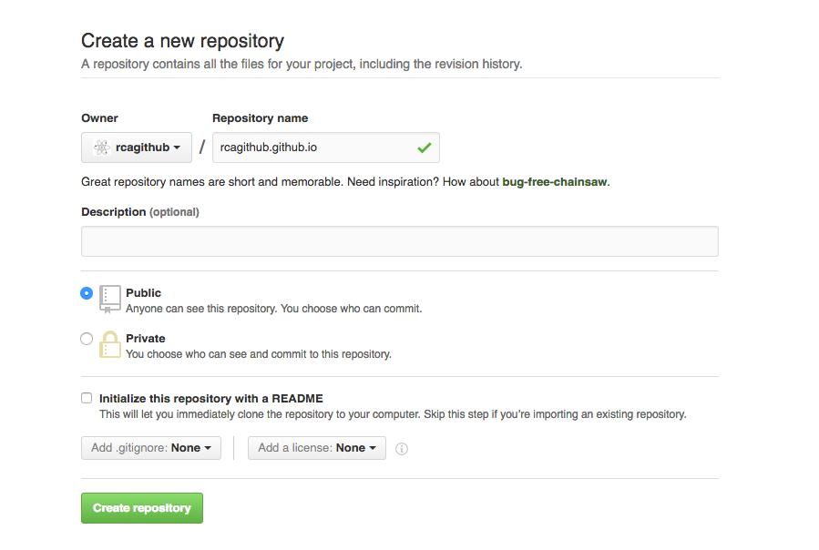

# Publish your Portfolio Website to Github

[Github](http://github.com) has a cool feature for hosting static web content. Projects made with pure HTML, CSS and front-end Javascript are typically static websites and we can host them for free on Github.com.

## Getting things setup locally

Make sure that your portfolio website is self contained in a project folder such as `/projects/portfolio`. You should not have other projects in this folder.

1. Open this folder in your terminal and run `git init` to start tracking these files with git.

2. Add your files to be tracked by git with `git add .`.

3. Verify that you have added your files with `git status`.

4. Create your first commit message: `git commit -m "added my portfolio page"`

## Getting things setup on Github

1. Create a new repository under your personal account with the name `yourusername.github.io`. Replace `yourusername` with your actual Github username :stuck_out_tongue:

  

2. Take the git url from the newly created repository and add it as a remote to your local git directory: `git add remote origin git@github.com:yourusername/yourusername.github.io.git`.

3. Push your portfolio page up to Github with `git push origin master`.

4. Wait a couple minutes and visit `http://yourusername.github.io` to see your website online!

5. If you see any issues or make any future updates, you can simply make your changes locally, make a new commit and do another `git push` to update your website!

6. :zap: :zap: :zap: Make sure that your main page is named `index.html` or it will not load when you visit `http://yourusername.github.io`. :zap: :zap: :zap:

### Bonus: Adding your own domain to Github

If you'd like to point your own domain, like `http://colinloretz.com` to your portfolio page, you can [check out how to do so here](https://help.github.com/articles/quick-start-setting-up-a-custom-domain/).
