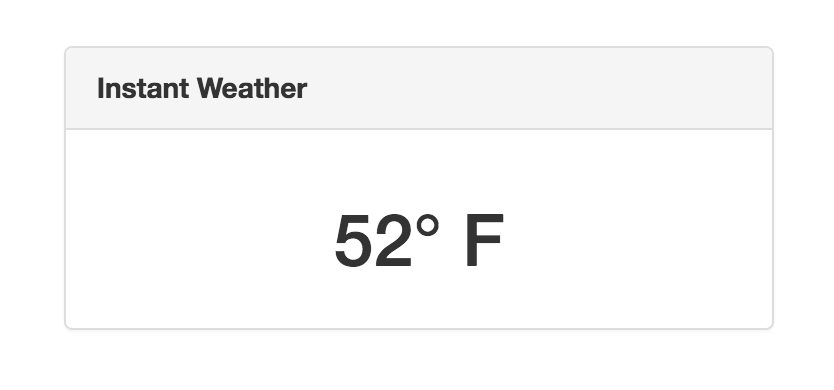

# Weather Widget

#### Goals
Create an app that displays the local weather. You can select whatever weather conditions you'd like to display: temperature, clouds, sun, rain, etc.

You will need to create an account at [http://openweathermap.org](http://openweathermap.org) to use their API.

Their API docs are [available here](http://openweathermap.org/api). These will come in handy!

How might you build this so a user can change the widget using a zip code?

:warning: This project requires that you use an API Key. It is not good practice to publish your API key in your Github repository OR published in a client side application such as this one. The API key would then be available for others to use. In this case, they would only be able to get the weather but they are still acting on your behalf so your API key and Open Weather Map account could potentially be banned.

##### Example

